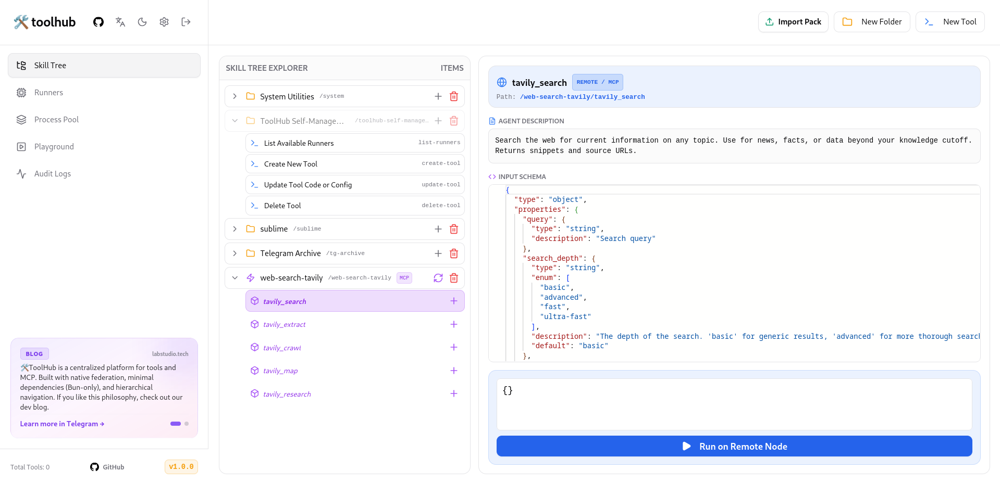
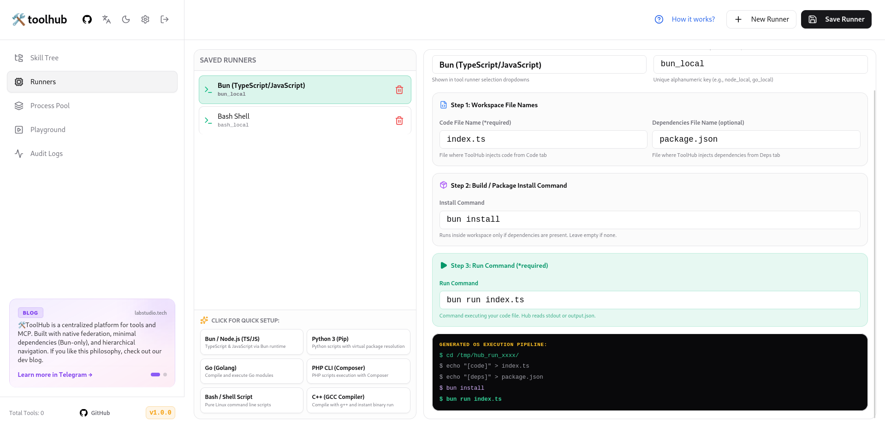
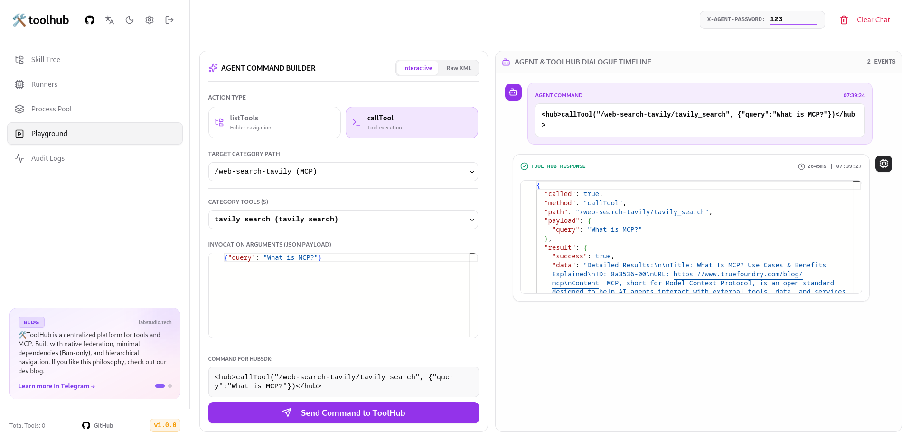
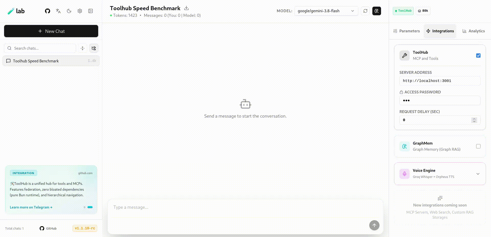

# 🛠️ toolhub

  <b>English</b> | <a href="#russian-version">Русский</a> | <a href="#chinese-version">中文</a>

---

**TOOL HUB** is a high-performance, self-hosted, open-source platform for creating, orchestrating, federating, and securely executing tools for AI agents of any kind.

Stop hardcoding functions into system prompts and overloading model context windows with hundreds of API schemas. **TOOL HUB** provides agents with a structured, distributed skill file system featuring on-the-fly tree navigation and a unified interaction contract.

---

## 📸 Screenshots

  
  
  

---

## 🎬 Live Demo & Web Client

ToolHub works out-of-the-box with the open-source **[🧪 lab (labstudio.tech)](https://labstudio.tech)** web client ([GitHub Repo](https://github.com/Talos-popcorn/lab)) — an ultra-lightweight, serverless LLM workspace:

  

---

## 🧩 Ecosystem & Tooling

Community-driven packages and tools extending the ToolHub ecosystem:

- **[TWYLT](https://github.com/Godhart/twylt)** — Language-independent self-describing tool protocol (Python reference implementation with Pydantic).
- **[ToolPack Builder](https://github.com/Godhart/toolpack-builder)** — CLI & GUI builder for scanning local scripts, managing isolated environments, and packing them into `.toolpack` archives.

---
## 🆚 How ToolHub differs from typical MCP gateways (MCPJungle, MCPHub, etc.)

| Criterion | ToolHub | MCPJungle / MCPHub (typical MCP gateway) |
|---|---|---|
| Core approach | Execution engine: turns any script (Bun, Python, Go, Bash, etc.) into a tool on the fly | Proxy registry: registers pre-built MCP servers and grants access to them |
| Creating a tool | Write a script → it instantly becomes an agent tool | Requires an already-built MCP server implementing the protocol |
| Navigation | Hierarchical folder tree (`listTools("/system")`) | Flat list of registered servers/tools, grouped via Tool Groups |
| Federation | Infinitely nested REMOTE nodes (hub → hub → hub) | Single layer: client → gateway → servers, no recursive nesting |
| MCP integration | Supports MCP as one category type (Stateless + Stateful Pool) | MCP is the only supported format |
| MCP → native tool conversion | Yes (MCP Promote) | Not available |
| IDE integration | Yes (Sublime Merge diff, replace-literal, native Ctrl+Z) | Not available |
| Access control | Tool toggles in admin panel, two password tiers (agent/admin) | ACL/RBAC, Tool Groups, per-client tokens (in enterprise mode) |

---

## 🎯 Core Concepts & Philosophy

1. **Zero Docker Needed**: Written in **Bun**, running code directly in isolated OS temp workspaces. Runs effortlessly on Raspberry Pi, lightweight VPS, or bare-metal servers. (Containerization/VM wrappers can still be attached on the runner layer).
2. **Language Agnostic**: Turn any script in **Bun, Node.js, Python, Go, Bash, PHP, Deno, C++** into an AI tool. If a command runs in a terminal, it becomes an agent skill.
3. **Strict Hierarchical Navigation**: Tools are organized as a filesystem folder tree. Models browse categories via `listTools()`, select the target tool, and execute it via `callTool()`.
4. **Infinite Federation**: Connect ToolHub instances into nested tree networks with automated path normalization and cycle protection.
5. **Dual-Mode MCP Engine**: Support for Model Context Protocol (MCP) in standard Stdio spawn mode and **Stateful Persistent Pools** for memory-heavy sessions (Puppeteer, SSH, databases).

---

## 🛠 Architectural Overview